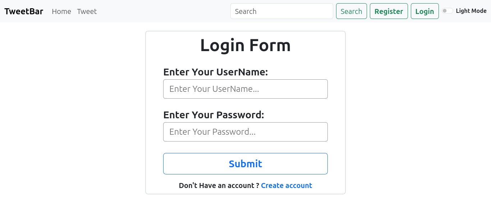

# Tweet Project With Django :-

Welcome to the Django Tweet Project! This application allows users to create and edit tweets. It's a simple yet powerful demonstration of Django's capabilities for handling user-generated content.

## Features :- 

- **Create Tweets:** Users can compose and post new tweets.
- **Edit Tweets:** Users can modify their existing tweets.
- **User Authentication:** Users can register, log in, and manage their accounts.
- **Light / Dark Mode** Feature.

## Usage

- Home Page: Visit the homepage to view and create tweets.
- Edit Tweets: Click on a tweet to edit it.

## Screenshots

Here are some screenshots of the application:
- **Home Page :-** The home page shows a list of tweets. 
    

- **Login Page :-** The login page allows users to sign in to their accounts.

- **Registration Page :-** The registration page enables new users to create an account.
 

## Contributing

Feel free to contribute to this project by creating issues or submitting pull requests. If you have any questions or suggestions, please open an issue on GitHub.

## Acknowledgements

- Django Documentation: [Click Here](https://www.djangoproject.com/)
- Inspiration and guidance from various Django tutorials and resources.